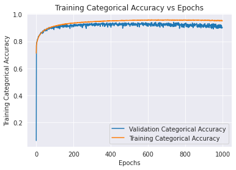
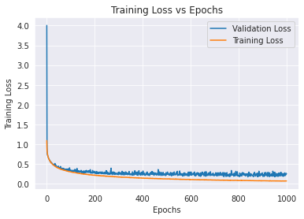
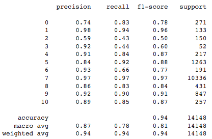
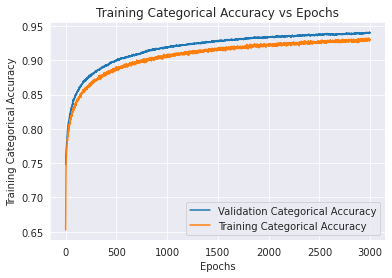
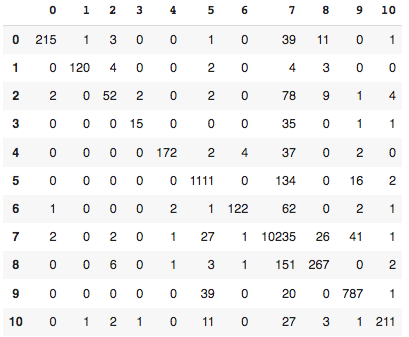
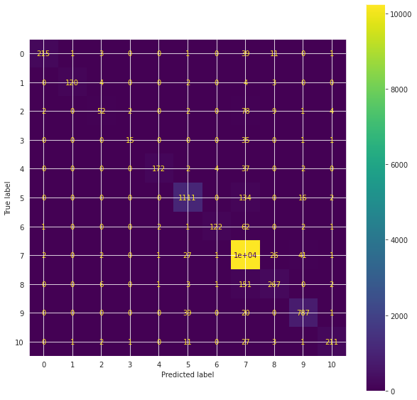
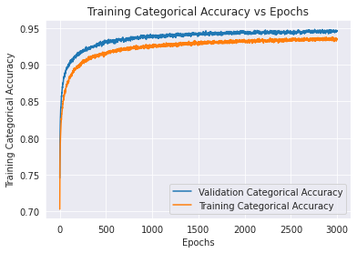
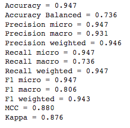

#### [Atrás](datos.md) -- [Índice](index.md) -- [Siguiente](conclusiones.md)
***

# Resultados

## Resultados con red convolucional simple ConvoRGB

La red convolucional simple, que denominamos ConvoRGB, se ajusta para todos sus parámetros, según los parámetros y el dataset descritos en los apartados anteriores con los siguientes resultados y métricas.

### Ajuste de red convolucional simple ConvoRGB

Las gráficas de accuracy muestran que la red aprende a niveles superiores del 90% de los datos de entrenamiento, pero presenta rápidamente un sobreentrenamiento (overfitting) leve porque los datos sobre el dataset de validación empeora con las epochs.

Las gráficas de loss tienen un comportamiento opuesto (como es lógico) a las de accuracy.

Las gráficas del coeficiente de Matthews validan lo observado en las anteriores, e incluso ayudan a ver que entre 400 y 600 epochs se alcanza un máximo en el entrenamiento y al final del entrenamiento realizado ambas gráficas (entrenamiento y validación) tienden a empeorar.

En relación a lo anterior, hay que indicar que los callbacks permiten guardar cada modelo o solo los mejores, por lo que es posible resolver problemas de sobreentrenamiento (por el dataset o la configuración) reiniciando el entrenamiento con una mejor configuración del sistema, salvaguardando los resultados alcanzados previamente.

### Precisiones con red convolucional simple ConvoRGB

Se muestran a continuación los diversos indicadores estadísticos del ajuste de la red ConvoRGB.

Los valores de las métricas permite afirmar que la red ConvoRGB parece modelar el dataset de trabajo.

Aquellas metricas que tienen en cuenta cada una de las clases presentan unos resultados más discretos. Esto tiene sentido por la presencia de una clase superrepresentada (la clase normal) que puede enmascarar los problemas con otras clases subrepresentadas.

### Matriz de confusión con red convolucional simple ConvoRGB

La matriz de confusión con los datos de validación para la red ConvoRGB tiene los siguientes valores:

La matriz de confusión con los datos de validación para la red ConvoRGB representada gráficamente queda como:

Si normalizamos la matriz de confusión respeto a los datos verdaderos para la red ConvoRGB queda como:

Los mejores resultados se obtienen para la clase 7-Normal, así como las clases 1-Blood_fresh y 5-Ileocecal_valve . Por su lado los peores resultados se obtienen para las clases 2-Erosion 3-Erythematous y 6-Lymphangiectasia.

Una mayor número de imágenes tiende a ayudar a mejores resultados procentuales, aunque las características de las lesiones o regiones fisiológicas parece definitiva, como la clase 1, que pese a estar poco presente obtiene buenos resultados.

## Resultado de transferencia de conocimiento con red ResNet

La red convolucional que denominamos ResNet, se ajusta para sus parámetros libres según se ha descritos en los apartados anteriores con los siguientes resultados y métricas.

### Ajuste de red ResNet

Las gráficas de accuracy muestran que la red basada en ResNet aprende a niveles superiores del 93% de los datos de entrenamiento, sin sobreentrenamiento. De hecho el entrenamiento se interrumpe quizás anticipadamente aunque tampoco sea posible obtener valores muy superiores.

Las gráficas de accuracy y loss tienen los esperados comportamientos opuestos para el entrenamiento de la red ResNet.

El coeficiente de Matthews para la validación roza el 85%, aproximadamente igual a los mejores resultados de la red ConvoRGB del primer apartado.

Los resultados de la red ResNet son numéricamente análogos a la red ConvoRGB, y aunque las gráficas parecen menos ruidosas, hay que tener presente la escala horizontal (una es 3 veces la otra).

### Precisiones con red ResNet

Se muestran a continuación los diversos indicadores estadísticos del ajuste de la red ResNet.

Los valores obtenidos para la red ResNet no parecen diferir sustancialmente de los obtenidos por la red ConvoRGB. 

De nuevo, como en el caso anterior, las métricas macro (calculadas por clase y posteriormente agrgadas) son peores que las micro (se toman todos los datos conjuntamente). Esto está indicando que los modelos no resuelven bien las clases poco representadas.

### Matriz de confusión con red ResNet

La matriz de confusión con los datos de validación para la red ResNet tiene los siguientes valores:

La matriz de confusión con los datos de validación para la red ResNet representada gráficamente queda como:

Si normalizamos la matriz de confusión respeto a los datos verdaderos para la red ResNet queda como:

Los mejores resultados se obtienen para la clase 7-Normal, así como las clases 9-Reduced_mucosal_view y 1-Blood_fresh. Por su lado los peores resultados se obtienen para las clases  3-Erythematous, 2-Erosion y 8-Pylorus.

La semejanza de los resultados con los anteriores ratifica qeu una mayor número de imágenes tiende a ayudar a mejores resultados procentuales, aunque las características de las lesiones o regiones fisiológicas siguen siendo definitivas.

## Resultado de transferencia de conocimiento con red DenseNet

La red convolucional que denominamos DenseNet, como el caso anterior, se ajusta para sus parámetros libres según se ha descritos en los apartados anteriores con los siguientes resultados y métricas.

### Ajuste de red DenseNet

Las gráficas de accuracy muestran que la red basada en DenseNet aprende a niveles del 93% de los datos de entrenamiento, sin sobreentrenamiento. En este caso el entrenamiento parece suficiente porque las gráficas son bastante planas al final del mismo. 

El loss se comporta como es esperado, aunque su valor absoluto sea complejo de interpretar, almenos más que la accuracy.

El coeficiente de Matthews con DenseNet reproduce lo observadado para ResNet, con valores muy similares y compatibles con ResNet e incluso ConvoRGB.

### Precisiones con red DenseNet

Se muestran a continuación los diversos indicadores estadísticos del ajuste de la red DenseNet.

Los resultados de la evaluación con DenseNet es similar a las anteriores. Valores superiores al 90% para todas las muestras que se reducen a valores del 80% si se toman en consideración las clases (algunas de ellas muy sub-representadas en el dataset)

El resto de métricas muestran comportamiento similar a los modelos ConvoRGB y ResNet, con resultados que no difieren suficientemente como para establecer jerarquías entre los modelos.

### Matriz de confusión con red DenseNet

La matriz de confusión con los datos de validación para la red DenseNet tiene los siguientes valores:

La matriz de confusión con los datos de validación para la red DenseNet representada gráficamente queda como:

Si normalizamos la matriz de confusión respeto a los datos verdaderos para la red DenseNet queda como:

Los mejores resultados se obtienen para la clase 7-Normal, así como las clases 9-Reduced_mucosal_view y 5-Ileocecal_valve. Por su lado los peores resultados se obtienen para las clases 3-Erythematous, 2-Erosion y 6-Lymphangiectasia.

Las clases peor clasificadas re repiten para todos los modelos, pero para las mejores clases la 7-Normal siempre domina al resto.

***
#### [Atrás](datos.md) -- [Índice](index.md) -- [Siguiente](conclusiones.md)
